# Iteration1:

Member: Yuan Liu, Xinchang Meng
1.Created components to represent the functionalities and the overall structure of StreetsAhead app
2.Established navigation
3.Basis of CRUD operations to Firestore worked

Screenshots:

1. Signup
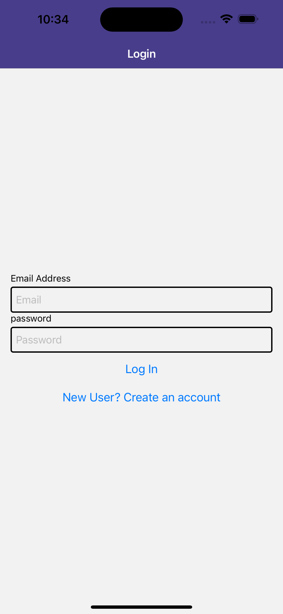

2. Login
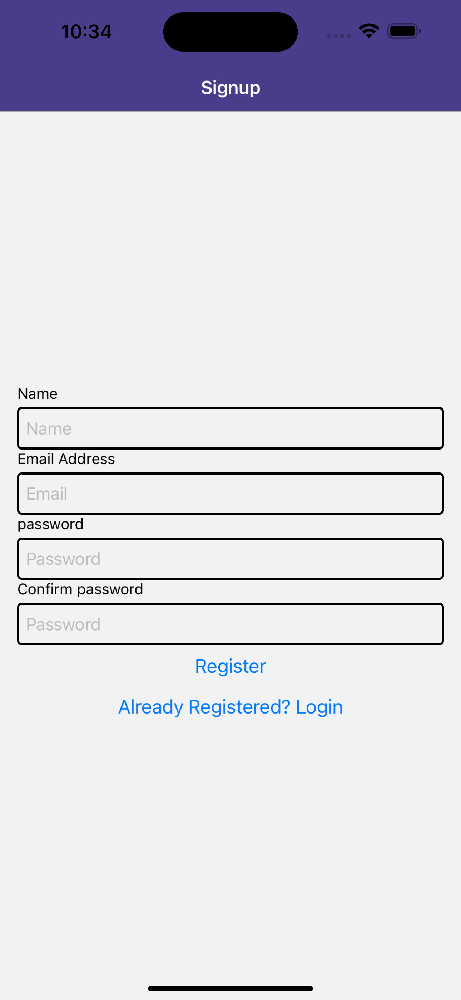

3. Map Screen
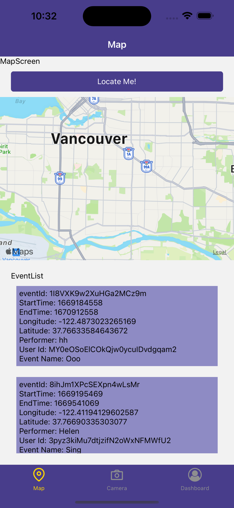

4. Camera Screen

5. Create post Screen
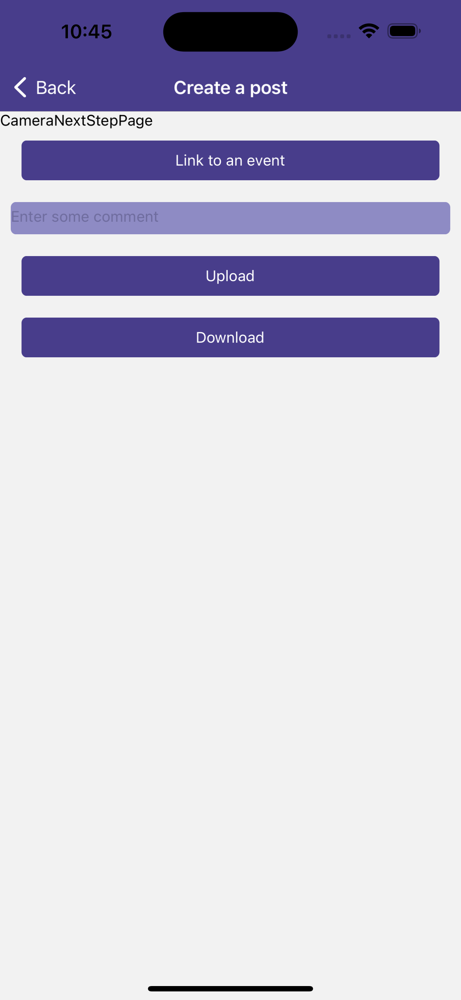

6. Find event to link to post

7. Filter nearby event to link to post
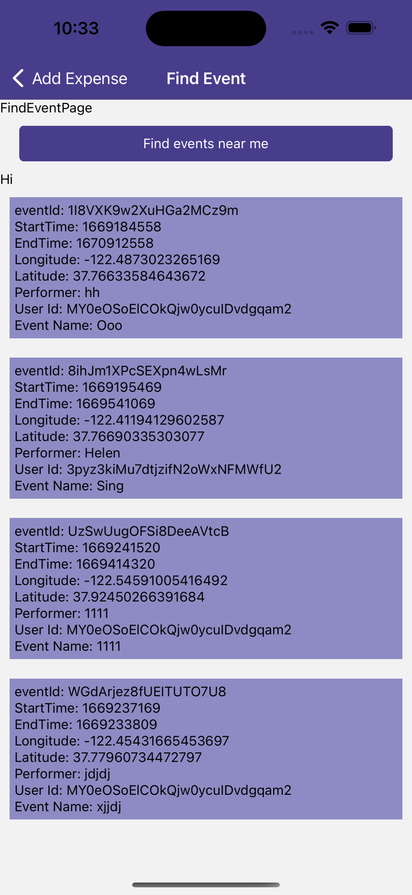

8. Upload the post
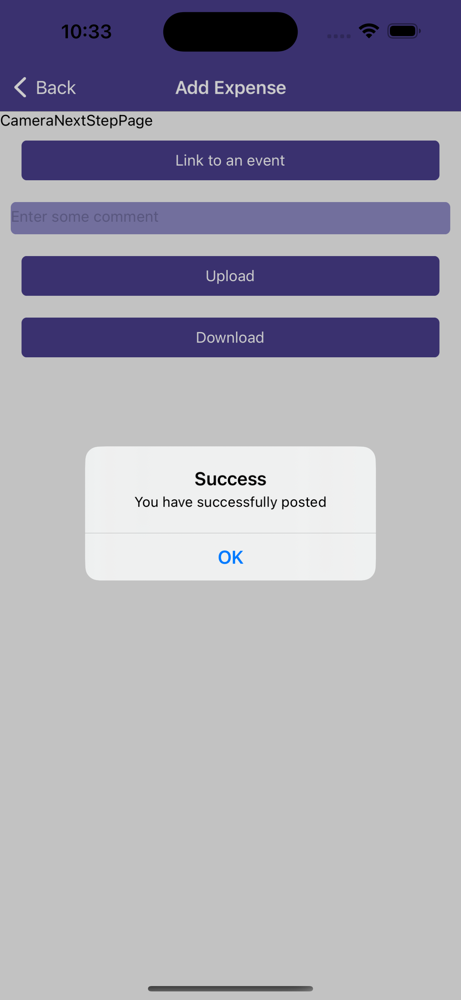

9. Event Detail Page

10. User Dashboard
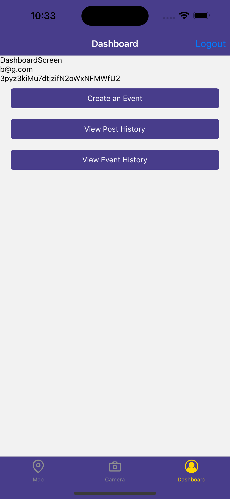

11. Create Event Screen
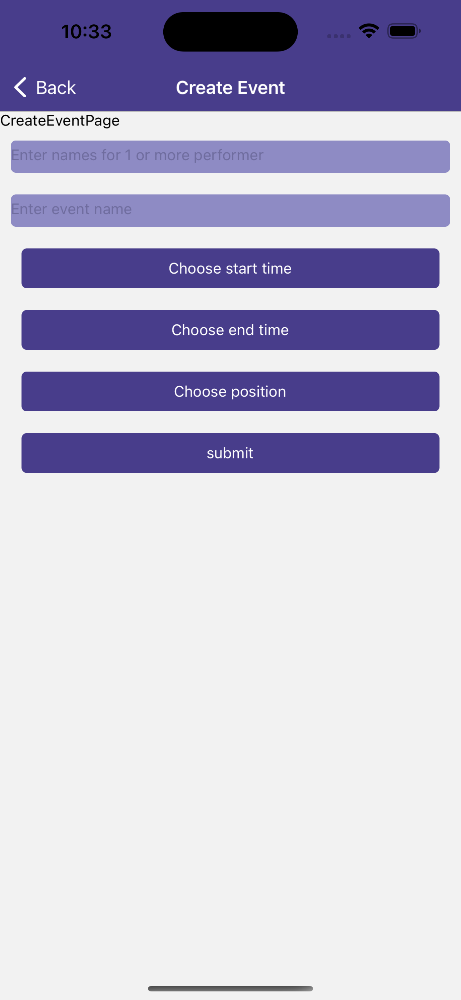

12. Choose time for event
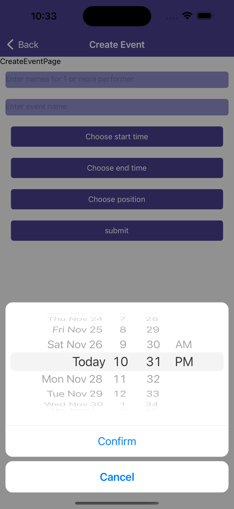

13. Choose location for event
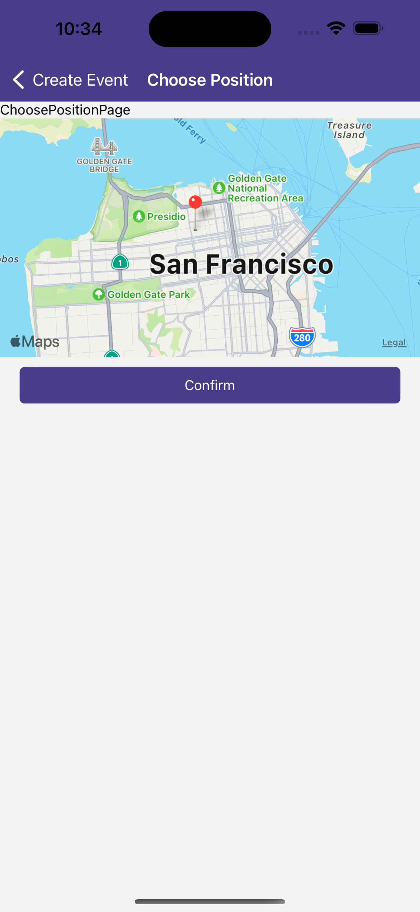

14. Events created by the user
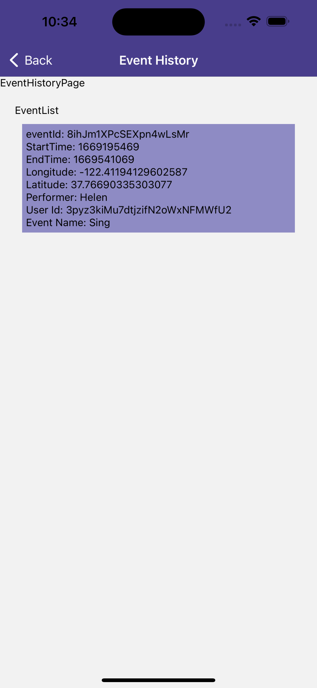

15. Posts created by the user
