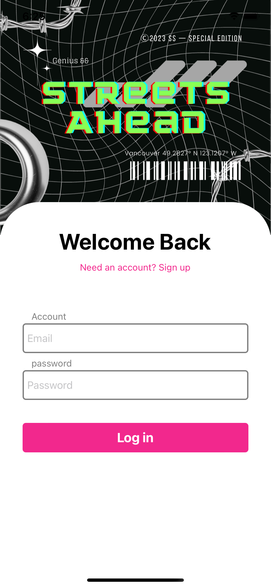
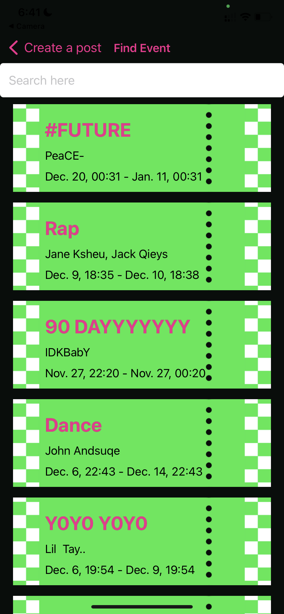
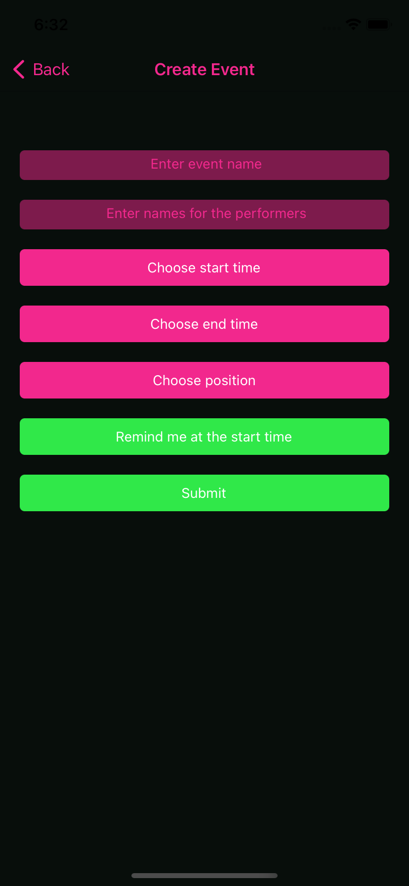
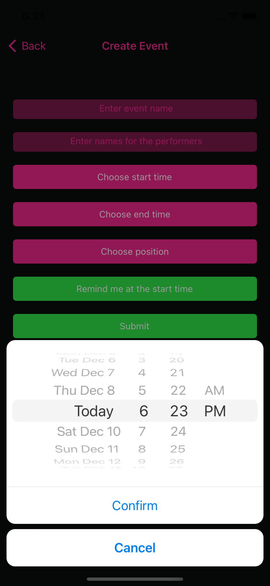
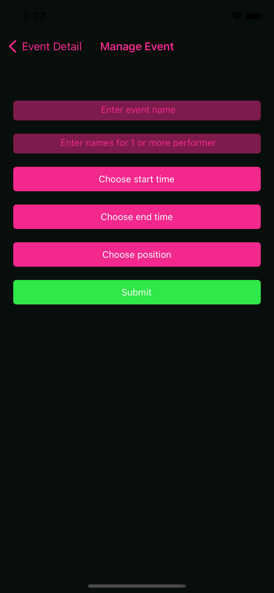
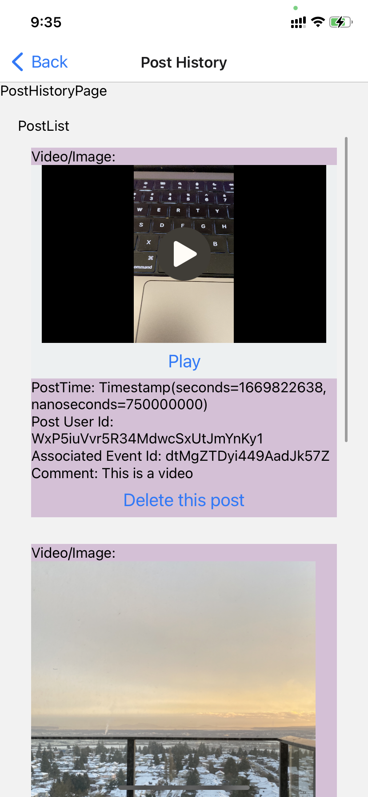
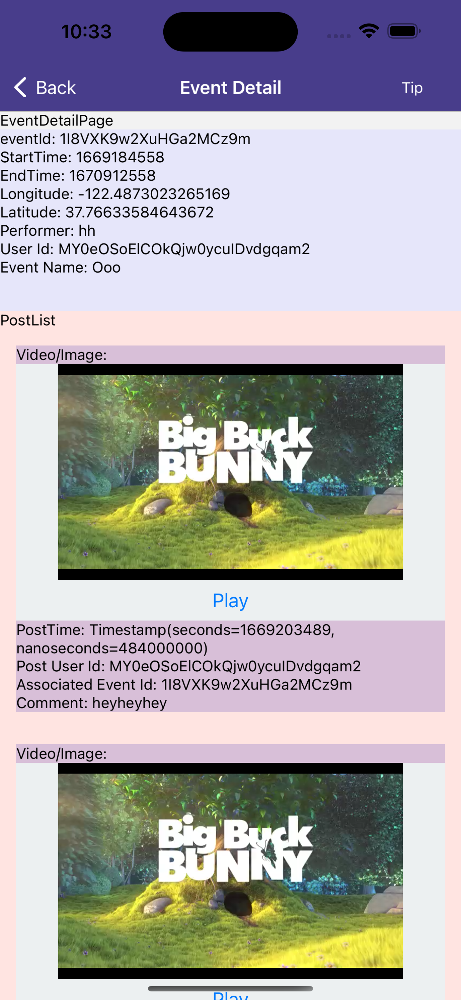

# Iteration3:
In this iteration. we finished implementing all functionalities planned and debudgged.

Contributions: Xinchang Meng and Yuan Liu worked together to 1. Implement the complete functionalities for interactive map, camera and creating events/posts 2. Implement the UI, responsiveness, and visual effects. 3. Debugged and made sure eveything works fine.
 
Screenshots:
 
IOS:
 
1. Login

2. SignUp

3. Map Screen Permission and Initial place

4. Map screen locate current position

5. Click on the green heart to see detail page of event, you can see everyone's post

6. Camera screen

7. Short tap to take photo or long tap to take video

8. Move on to make a post

9. Find the event to link to by searching by name, click on the event to link

10. Click on upload to submit

11. Click on download to save the media

12. User Dashboard Screen

13. Create an event

14. Set up a notification for reminding the start time of the event

15. View post history created by current user, user can delete by clicking on the trash can

16. View event history created by current user, the detail page directed by these items has edit and delete buttons

17. Edit event info for the event created by current user

18. Delete event created by current user

19. Tip an event by clicking on the cash button on event detail page

20. LogOut

 
Some Android Screenshots:
 

# Iteration2:

 
In this iteration, we worked on improving the functionalities about the usage of interactive map, camera, uploading/downloading media, search, notification and styling.

 
Contributions:
 
Xinchang Meng: Implemented the functionalities to display events on the interactive map and zooming into current location for the interactive map; functionalities for taking photos and videos on the camera page; the preview page after taking the photo or video; the UI for the map screen and camera screen; making sure the file structue is neat.

 

Yuan Liu: Implemented the search bar and associating functionalities in find event page; the functionalities about uploading/downloading media; local notification to remind user of the start time of an event; updating/deleteing events and delete posts; validation of the input for creating post and event; interactive map marker clicking redirection.

 
Screenshots:
 
1. Showing the event on the interactove map, users can go to the detail page by clicking on the marker

2. Zooming in to the current location to check out events nearby

3. The camera screen, users can take photo or record video by tapping or long-pressing the circle

4. The preview page, user can either go back or go to next step to make a post

5. Users can use the search bar in the find-event-page for linking event to a post

6. Searching for an event by name

7. User must input all fields to make a post

8. Click the download button to save the photo/video to local camera roll, click upload to submit the post

9. Users can delete their post 

10. Users can edit or delete events they've created by clicking on events in the event history page

11. The edit event page

12. The map in the choose position page for creating new event can also zoom to current location

13. Users can click on the "Remind me at start time" button to receive a notification at the start time of the event

14. The notification

 

# Iteration1:

Member: Yuan Liu, Xinchang Meng
Contributions:
1.Created components to represent the functionalities and the overall structure of StreetsAhead app (Yuan Liu and Xinchang Meng)
2.Established navigation (Xinchang Meng)
3.Basis of CRUD operations to Firestore worked (Yuan Liu)

Screenshots:

1. Signup

2. Login

3. Map Screen

4. Camera Screen

5. Create post Screen

6. Find event to link to post

7. Filter nearby event to link to post

8. Upload the post

9. Event Detail Page

10. User Dashboard

11. Create Event Screen

12. Choose time for event

13. Choose location for event

14. Events created by the user

15. Posts created by the user
